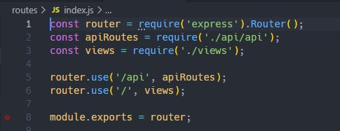
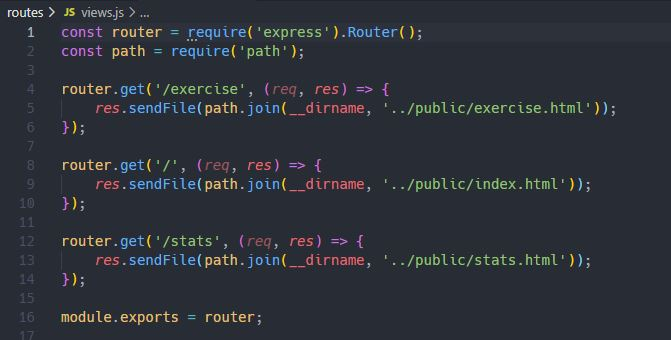
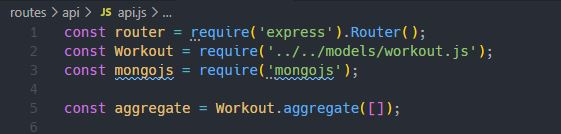
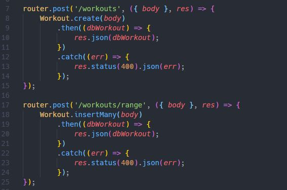
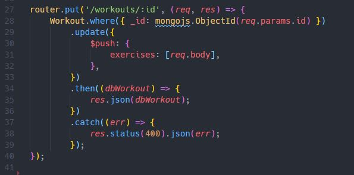
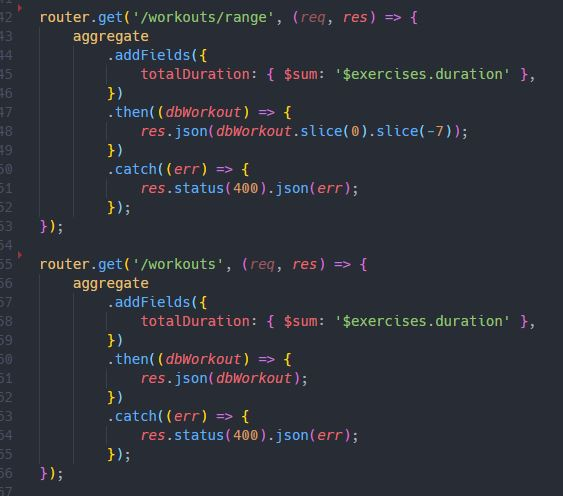

# Workout Tracker Application


## Description

Link to App: https://brownnicholasj-workout-tracker.herokuapp.com/

- This Workout Tracker was developed to allow a user to reach their fitness
  goals by tracking their workout process.
- The technology used for this application are: node, javascript, express (npm),
  mongojs (npm), mongoose (npm), morgan (npm), MongoDB, Heroku
- The biggest challenge with this project was deciphering the front end and
  create a back end to fit it, without changing the front end
  functionality/design.

## Table of Contents

- [Installation](#installation)
- [Usage](#usage)
- [License](#license)
- [Contributing](#contributing)
- [Behind The Code](#behind-the-code)
- [Questions](#questions)

## Installation

To install necessary dependencies, run the following command:

```
npm i
```

The following dependencies will be installed:

- express
- mongojs
- mongoose
- morgan

## Usage

A user will go to the page at
https://brownnicholasj-workout-tracker.herokuapp.com/ and see the landing page
with the last workout statistics


The user has the options to 'Continue Workout', start a 'New Workout', or view
the 'Dashboard.

Choosing the Dashboard button takes the user to a screen that shows the
following:

- View the combined weight of multiple exercises from the past seven workouts
  and
- View the total duration of each workout from the past seven workouts
   From this page, the user will
  navigate back to the home page by clicking 'Fitness Tracker' in the top right

When the user chooses the 'Continue Workout' option they are taken to a
selection page to choose the type of exercise


When a user selects a dropdown option, they will be allowed to put in the
exercise attributes 

When the user has filled in all of the required fields, the option to 'Complete'
or 'Add Exercise' will be eligible to be clicked


- Pressing 'Complete' will submit the data to the database and direct the user
  back to the homepage.
- Pressing 'Add Exercise' will submit the data to the database, but keep the
  user on this page to enter another exercise to the same workout.

From the Homepage, when a user wants to record a 'New Workout' they are taken to
the same screen to select an Exercise, the difference is the Database creates a
new Object (workout) to store exercises in


After the user selects the exercise type they can put the attributes of the
exercise in the workout the same way explained above


## License

This project is licensed under the MIT license.

## Contributing

A thanks to the following contributors to this project:

- 2021 Trilogy Education Services, LLC
- Nicholas Brown (brownnicholasj.dev@gmail.com)

### Behind the Code

As the front end of the code was 'provided' by Trilogy Education Services, this
review will be focused on the back end code, specifically the routes and
interaction with the MongoDB.

- The routes were created using express.router and stored on two javascript
  files (api.js and views.js) <br> 

- The 'views' routes are handling sending the HTML pages to display the correct
  UI to the user as they traverse the application: <br>
  

- The 'api' routes are handling the data requests from the database with MongoBD

  - Showing in four sections, the first is the constants that are created to
    house the requirements for the api.js
    
  - The second section are the list of 'POST' actions to save data to the
    database. This handles when a user 'creates' a new workout or saves a new
    exercise to a workout. 
    - the '/workouts/range' was kept in to accept an integration file to import
      more than one entry at a time
  - The third section is the 'PUT' action, which will find a specific workout by
    looking up the mongoDB ObjectID (utilizing Mongojs)
    
  - The last section is the 'GET' actions, which will display the data. This is
    utilizing the aggregate property defined in section 1 in order to add fields
    and summarize the duration of all of the exercises in a workout.
    

## Questions

If you have any questions about the repo, open an issue or contact me directly
at brownnicholasj.dev@gmail.com.You can find more of my work at
[brownnicholasj](https://github.com/brownnicholasj/).
